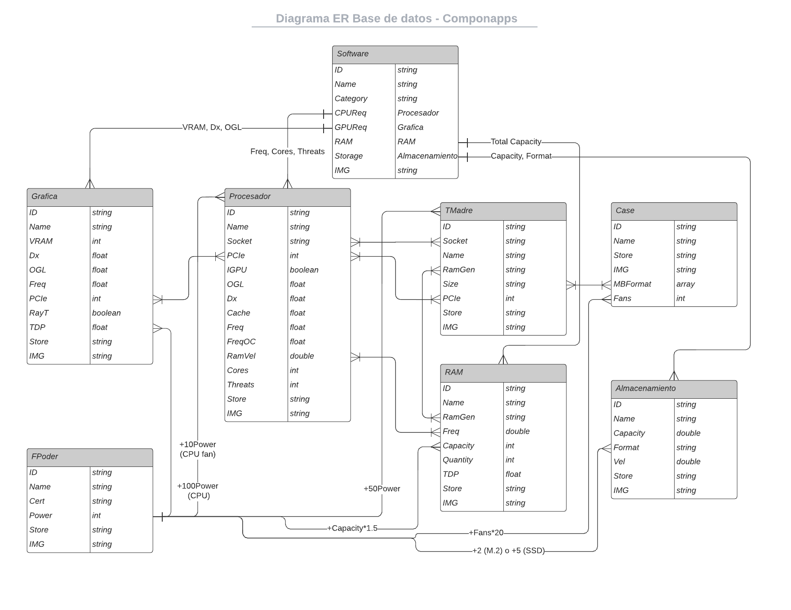

# Componapps
## Contexto
Componapps es un proyecto universitario para la carrera de ingeniería multimedia en la universidad San Buenaventura de Cali, este proyecto es realizado por los estudiantes Juan Pablo Orozco Peña y Julián Pedroza García.

## Objetivo General
Desarrollar una plataforma web como sistema de recomendación dirigido a compra de componentes de un 
computador dependiendo del perfil de uso de la persona.

## FrameWork Ionic
Para la realización de este proyecto se optó por la utilización del framework Ionic, la razón para utilizar este framework es por la facilidad que brinda respecto al desarrollo de plataformas web enfocadas para dispositivos móviles.

```npm
npm install -g @ionic/cli
```

## Tabs/Pantallas
El framework Ionic permite trabajar la plataforma web a traves de "tabs" donde cada "tab" es una pantalla diferente con una funcionalidad específica.

### Tab/Arma tu pc
Esta pantalla será la principal de la plataforma, en esta se mostrará una cuadrícula de software donde solicitará al usuario elegir entre 1 y 3 tipos de software que serán los necesarios para definir el tipo de componentes que necesita su pc y luego de seleccionarlos dar al botón de "buscar pc" para que arroje los componentes recomendados.


### Tab/Resultado
Esta pantalla será una pantalla oculta para el usuario de primera mano, ya que deberá realizar la selección de software y dar al botón de "buscar pc" para poder obtener la recomendación de los componentes del pc. Los componentes recomendados se mostrarán en esta pantalla resultado además de agregarles un botón de compra que redirige al usuario a la página de Amazon en la que se puede comprar dicho componente.


### Tab/Información
En esta pantalla se mostrará una explicación sobre el funcionamiento de cada componente de un pc de una manera metafórica para que el usuario pueda entender sin necesidad de tener conocimiento técnico sobre el tema.


## Base de datos
### Firebase
Para este proyecto se optó por firebase como base de datos, en ella se encuentra la información sobre los componentes y sus atributos técnicos además de los software y sus requisitos de hardware.

### Tablas, Atributos Y Relaciones



## Sistema de recomendación

Este flujo de recomendación se ve reflejado en el archivo "src\app\resultado_page\content_Resultado\explore-container.component.ts" donde además de realizar el flujo, filtra y organiza los componentes de la base de datos con base en sus características importantes.
Ejemplo:
almacenamiento.sort(ByCapacity).
En este caso el almacenamiento se ordena de menor a mayor partiendo de su atributo "capacidad".
